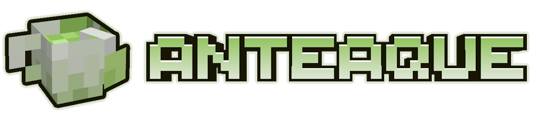

 
**Anteaque** is a _Minecraft_ mod that follows one premise: any students in the _Class of 2029 GAME program_ at _Brock Univerisity_ are allowed to contribute content, such as code, assets, and anything else to this mod*! This project serves as an easy way for GAME students to add content to their adjacent Minecraft server. This is the main repo we use for adding content!\
`* (content will be reviewed and must follow the rules below in order to be valid for addition.)`

# Rules for Content Submission
**Please follow these rules! Failure to do so may lead to your merge request being denied, and on more serious offenses a blacklist from this repo!**
1. **NO NSFW CONTENT**. Emphasis on nudity, heavy sexual topics, and fetishes.
2. Do not modify other people's assets without their permission. I will be keeping track on things people submit and if they're okay with things being changed / modified.
3. Do not add any backdoors / cheats made to benefit you.
4. Keep your content balanced for the setting of the pack. Don't add anything that could possibly be meta-defining without consultation first!
 
If you are unsure about something that may violate the rules, send me a DM and I'll clear it up for you!

# Process For Submitting Content
Content submission, while straightforward in practice, requires a couple of steps, namely to make sure the mod has some form of cohesion and doesn't devolve into a "kitchen sink"\
(a modpack which is full of random mods, most of which unmodified, leaving the modpack a mess in terms of direction and content).

### 1. Idea Approval
**This is arguably the most important step!!!** It is important that you get your idea approved before working on your content. Letting us know of your idea / plans for adding content beforehand gives us a good idea on what content is going to be added to the mod down the line. It also allows us to give you pointers and advice for your ideas.

### 2. Making the Content
Depending on what you want to add (such as adding assets for pre-existing objects, or creating new classes), make it in the programs that work best for it. Models for BlockBench, and code in an IDE of your choosing.

### 3. Content Submission
After you have your stuff made and in proper format, submit a merge request to this repo. From there, we'll let you know if there's any changes we need you to make, but if everything seems good to go, we'll accept your request and add it to the repo!
